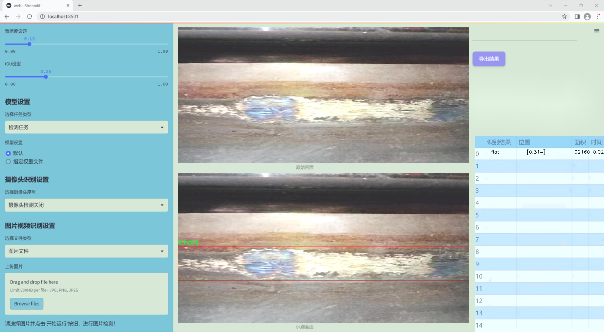
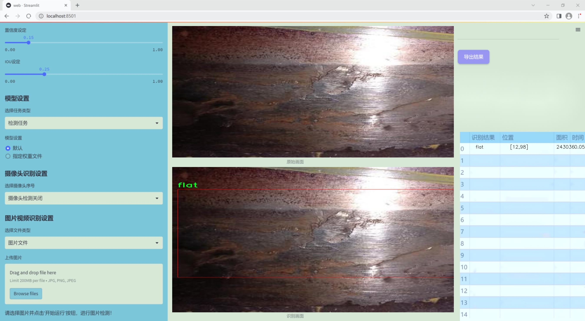
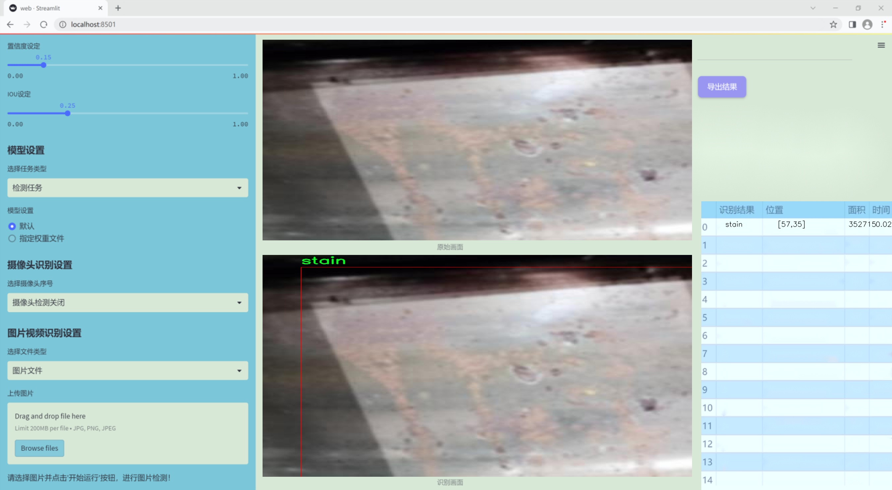
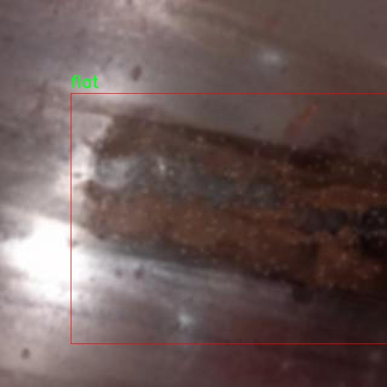
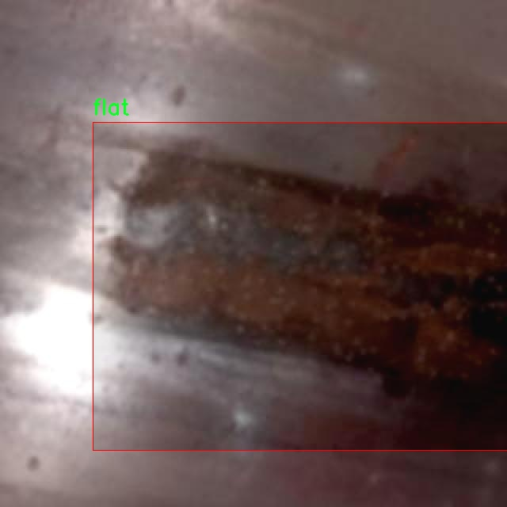
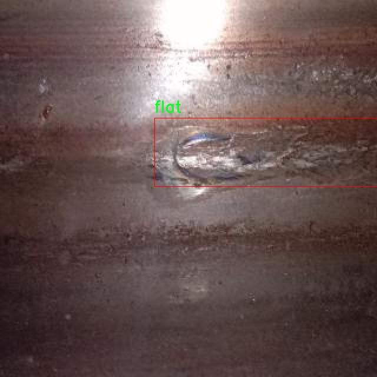
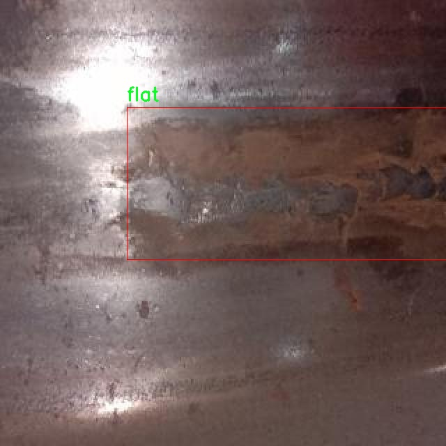
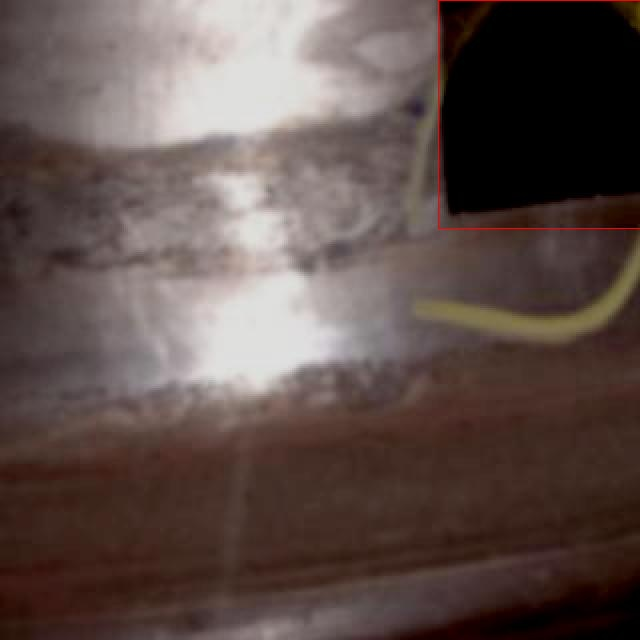

### 1.背景意义

研究背景与意义

随着工业制造的不断发展，表面缺陷检测在保证产品质量和提升生产效率方面变得愈发重要。法兰作为连接管道和设备的重要组件，其表面缺陷直接影响到连接的可靠性和安全性。因此，针对法兰表面缺陷的检测需求，开发高效、准确的检测系统显得尤为必要。传统的人工检测方法不仅耗时耗力，而且容易受到人为因素的影响，导致检测结果的不一致性和准确性不足。为此，基于计算机视觉技术的自动化检测系统应运而生，成为解决这一问题的有效手段。

在众多计算机视觉算法中，YOLO（You Only Look Once）系列因其高效的实时检测能力而受到广泛关注。YOLOv11作为该系列的最新版本，结合了深度学习和卷积神经网络的优势，能够在保证检测精度的同时，实现快速的图像处理。通过对YOLOv11的改进，针对法兰表面缺陷的检测系统能够更好地适应复杂的工业环境，识别出多种类型的缺陷，如平面缺陷、孔洞和污渍等。这三类缺陷不仅具有不同的形态特征，而且在生产过程中可能导致不同程度的质量问题，因此对其进行准确的分类和检测具有重要的实际意义。

本研究基于一个包含967张标注图像的数据集，涵盖了法兰表面缺陷的多种表现形式。数据集经过精心的预处理和增强，确保了模型训练的有效性和鲁棒性。通过引入先进的图像处理技术和深度学习算法，本项目旨在构建一个高效的法兰表面缺陷检测系统，提升检测的准确性和效率，进而为工业生产提供可靠的技术支持。该系统的成功实施不仅能够降低人工检测的成本，还能提高整体生产流程的自动化水平，推动智能制造的发展。

### 2.视频效果

[2.1 视频效果](https://www.bilibili.com/video/BV1J5STYnE3R/)

### 3.图片效果







##### [项目涉及的源码数据来源链接](https://kdocs.cn/l/cszuIiCKVNis)**

注意：本项目提供训练的数据集和训练教程,由于版本持续更新,暂不提供权重文件（best.pt）,请按照6.训练教程进行训练后实现上图演示的效果。

### 4.数据集信息

##### 4.1 本项目数据集类别数＆类别名

nc: 3
names: ['flat', 'hole', 'stain']


该项目为【目标检测】数据集，请在【训练教程和Web端加载模型教程（第三步）】这一步的时候按照【目标检测】部分的教程来训练

##### 4.2 本项目数据集信息介绍

本项目数据集信息介绍

本项目旨在改进YOLOv11模型在法兰表面缺陷检测中的应用，所使用的数据集专注于识别和分类三种主要的缺陷类型：平面缺陷（flat）、孔洞缺陷（hole）和污渍缺陷（stain）。数据集的设计考虑到了法兰表面可能出现的各种缺陷情况，以确保模型在实际应用中的有效性和可靠性。为了实现这一目标，数据集包含了大量的图像样本，这些样本涵盖了不同的光照条件、视角和背景，从而增强了模型的泛化能力。

在数据集的构建过程中，特别关注了学习率（learning rate）的设置，以便在训练过程中能够有效地调整模型参数，优化检测性能。学习率的选择对于深度学习模型的收敛速度和最终性能至关重要，因此在数据集的实验阶段，我们进行了多次试验，以确定最优的学习率范围。通过对不同学习率下模型训练效果的评估，我们能够更好地理解模型在处理法兰表面缺陷时的表现。

数据集中包含的三类缺陷，不仅反映了法兰表面可能出现的实际问题，也为模型提供了丰富的训练样本，使其能够在真实场景中更准确地进行缺陷检测。每一类缺陷的样本数量经过精心设计，以确保模型在训练时能够获得均衡的学习机会，从而避免过拟合某一特定类别。最终，通过对该数据集的深入分析和应用，我们期望提升YOLOv11在法兰表面缺陷检测任务中的准确性和效率，为工业检测提供更为可靠的技术支持。











### 5.全套项目环境部署视频教程（零基础手把手教学）

[5.1 所需软件PyCharm和Anaconda安装教程（第一步）](https://www.bilibili.com/video/BV1BoC1YCEKi/?spm_id_from=333.999.0.0&vd_source=bc9aec86d164b67a7004b996143742dc)


[5.2 安装Python虚拟环境创建和依赖库安装视频教程（第二步）](https://www.bilibili.com/video/BV1ZoC1YCEBw?spm_id_from=333.788.videopod.sections&vd_source=bc9aec86d164b67a7004b996143742dc)

### 6.改进YOLOv11训练教程和Web_UI前端加载模型教程（零基础手把手教学）

[6.1 改进YOLOv11训练教程和Web_UI前端加载模型教程（第三步）](https://www.bilibili.com/video/BV1BoC1YCEhR?spm_id_from=333.788.videopod.sections&vd_source=bc9aec86d164b67a7004b996143742dc)


按照上面的训练视频教程链接加载项目提供的数据集，运行train.py即可开始训练



     Epoch   gpu_mem       box       obj       cls    labels  img_size
     1/200     20.8G   0.01576   0.01955  0.007536        22      1280: 100%|██████████| 849/849 [14:42<00:00,  1.04s/it]
               Class     Images     Labels          P          R     mAP@.5 mAP@.5:.95: 100%|██████████| 213/213 [01:14<00:00,  2.87it/s]
                 all       3395      17314      0.994      0.957      0.0957      0.0843

     Epoch   gpu_mem       box       obj       cls    labels  img_size
     2/200     20.8G   0.01578   0.01923  0.007006        22      1280: 100%|██████████| 849/849 [14:44<00:00,  1.04s/it]
               Class     Images     Labels          P          R     mAP@.5 mAP@.5:.95: 100%|██████████| 213/213 [01:12<00:00,  2.95it/s]
                 all       3395      17314      0.996      0.956      0.0957      0.0845

     Epoch   gpu_mem       box       obj       cls    labels  img_size
     3/200     20.8G   0.01561    0.0191  0.006895        27      1280: 100%|██████████| 849/849 [10:56<00:00,  1.29it/s]
               Class     Images     Labels          P          R     mAP@.5 mAP@.5:.95: 100%|███████   | 187/213 [00:52<00:00,  4.04it/s]
                 all       3395      17314      0.996      0.957      0.0957      0.0845


###### [项目数据集下载链接](https://kdocs.cn/l/cszuIiCKVNis)

### 7.原始YOLOv11算法讲解


##### YOLOv11三大损失函数

YOLOv11（You Only Look Once）是一种流行的目标检测算法，其损失函数设计用于同时优化分类和定位任务。YOLO的损失函数通常包括几个部分：
**分类损失、定位损失（边界框回归损失）和置信度损失** 。其中，

  1. box_loss（边界框回归损失）是用于优化预测边界框与真实边界框之间的差异的部分。

  2. cls_loss（分类损失）是用于优化模型对目标类别的预测准确性的部分。分类损失确保模型能够正确地识别出图像中的对象属于哪个类别。

  3. dfl_loss（Distribution Focal Loss）是YOLO系列中的一种损失函数，特别是在一些改进版本如YOLOv5和YOLOv7中被引入。它的主要目的是解决目标检测中的类别不平衡问题，并提高模型在处理小目标和困难样本时的性能。

##### 边界框回归损失详解

box_loss（边界框回归损失）是用于优化预测边界框与真实边界框之间的差异的部分。


##### box_loss 的具体意义


##### 为什么需要 box_loss

  * 精确定位：通过最小化中心点坐标损失和宽高损失，模型能够更准确地预测目标的位置和大小。
  * 平衡不同类型的目标：使用平方根来处理宽高损失，可以更好地平衡不同大小的目标，确保小目标也能得到足够的关注。
  * 稳定训练：适当的损失函数设计有助于模型的稳定训练，避免梯度爆炸或消失等问题。

##### 分类损失详解

在YOLO（You Only Look
Once）目标检测算法中，cls_loss（分类损失）是用于优化模型对目标类别的预测准确性的部分。分类损失确保模型能够正确地识别出图像中的对象属于哪个类别。下面是关于cls_loss的详细解读：

##### 分类损失 (cls_loss) 的具体意义

  
分类损失通常使用交叉熵损失（Cross-Entropy
Loss）来计算。交叉熵损失衡量的是模型预测的概率分布与真实标签之间的差异。在YOLO中，分类损失的具体形式如下：


##### 为什么需要 cls_loss

  * 类别识别：cls_loss 确保模型能够正确识别出图像中的目标属于哪个类别。这对于目标检测任务至关重要，因为不仅需要知道目标的位置，还需要知道目标的类型。

  * 多类别支持：通过最小化分类损失，模型可以处理多个类别的目标检测任务。例如，在道路缺陷检测中，可能需要识别裂缝、坑洞、路面破损等多种类型的缺陷。

  * 提高准确性：分类损失有助于提高模型的分类准确性，从而提升整体检测性能。通过优化分类损失，模型可以更好地学习不同类别之间的特征差异。

##### 分布损失详解

`dfl_loss`（Distribution Focal
Loss）是YOLO系列中的一种损失函数，特别是在一些改进版本如YOLOv5和YOLOv7中被引入。它的主要目的是解决目标检测中的类别不平衡问题，并提高模型在处理小目标和困难样本时的性能。下面是对`dfl_loss`的详细解读：

##### DFL Loss 的背景

在目标检测任务中，类别不平衡是一个常见的问题。某些类别的样本数量可能远远多于其他类别，这会导致模型在训练过程中对常见类别的学习效果较好，而对罕见类别的学习效果较差。此外，小目标和困难样本的检测也是一个挑战，因为这些目标通常具有较少的特征信息，容易被忽略或误分类。

为了应对这些问题，研究者们提出了多种改进方法，其中之一就是`dfl_loss`。`dfl_loss`通过引入分布焦点损失来增强模型对困难样本的关注，并改善类别不平衡问题。

##### DFL Loss 的定义

DFL Loss
通常与传统的交叉熵损失结合使用，以增强模型对困难样本的学习能力。其核心思想是通过对每个类别的预测概率进行加权，使得模型更加关注那些难以正确分类的样本。

DFL Loss 的公式可以表示为：


##### DFL Loss 的具体意义**

  * **类别不平衡：** 通过引入平衡因子 α，DFL Loss 可以更好地处理类别不平衡问题。对于少数类别的样本，可以通过增加其权重来提升其重要性，从而提高模型对这些类别的检测性能。
  *  **困难样本：** 通过聚焦参数 γ，DFL Loss 可以让模型更加关注那些难以正确分类的样本。当 
  * γ 较大时，模型会对那些预测概率较低的样本给予更多的关注，从而提高这些样本的分类准确性。
  *  **提高整体性能** ：DFL Loss 结合了传统交叉熵损失的优势，并通过加权机制增强了模型对困难样本的学习能力，从而提高了整体的检测性能。


### 8.200+种全套改进YOLOV11创新点原理讲解

#### 8.1 200+种全套改进YOLOV11创新点原理讲解大全

由于篇幅限制，每个创新点的具体原理讲解就不全部展开，具体见下列网址中的改进模块对应项目的技术原理博客网址【Blog】（创新点均为模块化搭建，原理适配YOLOv5~YOLOv11等各种版本）

[改进模块技术原理博客【Blog】网址链接](https://gitee.com/qunmasj/good)


#### 8.2 精选部分改进YOLOV11创新点原理讲解

###### 这里节选部分改进创新点展开原理讲解(完整的改进原理见上图和[改进模块技术原理博客链接](https://gitee.com/qunmasj/good)【如果此小节的图加载失败可以通过CSDN或者Github搜索该博客的标题访问原始博客，原始博客图片显示正常】
### 可变性卷积DCN简介
卷积神经网络由于其构建模块中固定的几何结构，本质上受限于模型几何变换。为了提高卷积神经网络的转换建模能力，《Deformable Convolutional Networks》作者提出了两个模块：可变形卷积（deformable convolution）和可变形RoI池（deformable RoI pooling）。这两个模块均基于用额外的偏移来增加模块中的空间采样位置以及从目标任务中学习偏移的思想，而不需要额外的监督。

第一次证明了在深度神经网络中学习密集空间变换（dense spatial transformation）对于复杂的视觉任务是有效的

视觉识别中的一个关键挑战是如何适应对象比例、姿态、视点和零件变形中的几何变化或模型几何变换。一般有两种方法实现：
1）建立具有足够期望变化的训练数据集。这通常通过增加现有的数据样本来实现，例如通过仿射变换。但是训练成本昂贵而且模型参数庞大。
2）使用变换不变（transformation-invariant）的特征和算法。比如比较有名的SIFT(尺度不变特征变换)便是这一类的代表算法。

但以上的方法有两个缺点：
1）几何变换被假定为固定的和已知的，这些先验知识被用来扩充数据，设计特征和算法。为此，这个假设阻止了对具有未知几何变换的新任务的推广，从而导致这些几何变换可能没有被正确建模。
2）对于不变特征和算法进行手动设计，对于过于复杂的变换可能是困难的或不可行的。

卷积神经网络本质上局限于模拟大型未知转换。局限性源于CNN模块的固定几何结构：卷积单元在固定位置对输入特征图进行采样；池化层以固定比率降低特征矩阵分辨率；RoI（感兴趣区域）池化层将RoI分成固定的空间箱（spatial bins）等。缺乏处理几何变换的内部机制。

这种内部机制的缺乏会导致一些问题，举个例子。同一个CNN层中所有激活单元的感受野大小是相同的，但是这是不可取的。因为不同的位置可能对应于具有不同尺度或变形的对象，所以尺度或感受野大小的自适应确定对于具有精细定位的视觉识别是渴望的。

对于这些问题，作者提出了两个模块提高CNNs对几何变换建模的能力。


deformable convolution（可变形卷积）
将2D偏移量添加到标准卷积中的常规网格采样位置，使得采样网格能够自由变形。通过额外的卷积层，从前面的特征映射中学习偏移。因此，变形采用局部、密集和自适应的方式取决于输入特征。


deformable RoI pooling（可变形RoI池化）
为先前RoI池化的常规库（bin）分区中的每个库位置（bin partition）增加了一个偏移量。类似地，偏移是从前面的特征图和感兴趣区域中学习的，从而能够对具有不同形状的对象进行自适应部件定位（adaptive part localization）。

#### Deformable Convolutional Networks
Deformable Convolution
2D卷积由两个步骤组成：
1）在输入特征图x xx上使用规则网格R RR进行采样。
2）把这些采样点乘不同权重w ww后相加。

网格R定义感受野大小和扩张程度，比如内核大小为3x3，扩张程度为1的网格R可以表示为：
R = { ( − 1 , − 1 ) , ( − 1 , 0 ) , … , ( 0 , 1 ) , ( 1 , 1 ) } R = \{(-1,-1),(-1,0),\dots,(0,1),(1,1)\}
R={(−1,−1),(−1,0),…,(0,1),(1,1)}

​
 一般为小数，使用双线性插值进行处理。（把小数坐标分解到相邻的四个整数坐标点来计算结果）


具体操作如图所示：


首先对输入特征层进行一个普通的3x3卷积处理得到偏移域（offset field）。偏移域特征图具有与输入特征图相同的空间分辨率，channels维度2N对应于N个2D（xy两个方向）偏移。其中的N是原输入特征图上所具有的N个channels，也就是输入输出channels保持不变，这里xy两个channels分别对输出特征图上的一个channels进行偏移。确定采样点后就通过与相对应的权重w点乘相加得到输出特征图上该点最终值。

前面也提到过，由于这里xy两个方向所训练出来的偏移量一般来说是一个小数，那么为了得到这个点所对应的数值，会采用双线性插值的方法，从最近的四个邻近坐标点中计算得到该偏移点的数值，公式如下：


具体推理过程见：双线性插值原理

#### Deformable RoI Poolingb
所有基于区域提议（RPN）的对象检测方法都使用RoI池话处理，将任意大小的输入矩形区域转换为固定大小的特征图。


 一般为小数，需要使用双线性插值进行处理。


具体操作如图所示：


当时看这个部分的时候觉得有些突兀，明明RoI池化会将特征层转化为固定尺寸的区域。其实，我个人觉得，这个部分与上述的可变性卷积操作是类似的。这里同样是使用了一个普通的RoI池化操作，进行一些列处理后得到了一个偏移域特征图，然后重新作用于原来的w × H w \times Hw×H的RoI。只不过这里不再是规律的逐行逐列对每个格子进行池化，而是对于格子进行偏移后再池化处理。

#### Postion﹣Sensitive RoI Pooling
除此之外，论文还提出一种PS RoI池化（Postion﹣Sensitive RoI Pooling）。不同于上述可变形RoI池化中的全连接过程，这里使用全卷积替换。

具体操作如图所示：


首先，对于原来的特征图来说，原本是将输入特征图上的RoI区域分成k × k k\times kk×k个bin。而在这里，则是将输入特征图进行卷积操作，分别得到一个channels为k 2 ( C + 1 ) k^{2}(C+1)k (C+1)的得分图（score maps）和一个channels为2 k 2 ( C + 1 ) 2k{2}(C+1)2k 2 (C+1)的偏移域（offset fields），这两个特征矩阵的宽高是与输入特征矩阵相同的。其中，得分图的channels中，k × k k \times kk×k分别表示的是每一个网格，C CC表示的检测对象的类别数目，1表示背景。而在偏移域中的2表示xy两个方向的偏移。
也就是说，在PS RoI池化中，对于RoI的每一个网格都独自占一个通道形成一层得分图，然后其对于的偏移量占两个通道。offset fields得到的偏移是归一化后的偏移，需要通过和deformable RoI pooling中一样的变换方式得到∆ p i j ∆p_{ij}∆p ij，然后对每层得分图进行偏移池化处理。最后处理完的结果就对应着最后输出的一个网格。所以其包含了位置信息。

原文论述为：


#### Understanding Deformable ConvNets
当可变形卷积叠加时，复合变形的效果是深远的。如图所示：


ps：a是标准卷积的固定感受野，b是可变形卷积的适应性感受野。

感受野和标准卷积中的采样位置在整个顶部特征图上是固定的(左)。在可变形卷积中，它们根据对象的比例和形状进行自适应调整(右)。


### 9.系统功能展示

图9.1.系统支持检测结果表格显示

  图9.2.系统支持置信度和IOU阈值手动调节

  图9.3.系统支持自定义加载权重文件best.pt(需要你通过步骤5中训练获得)

  图9.4.系统支持摄像头实时识别

  图9.5.系统支持图片识别

  图9.6.系统支持视频识别

  图9.7.系统支持识别结果文件自动保存

  图9.8.系统支持Excel导出检测结果数据


### 10. YOLOv11核心改进源码讲解

#### 10.1 FreqFusion.py

以下是对给定代码的核心部分进行分析和详细注释的结果。为了简化和突出关键功能，去掉了一些辅助函数和不必要的部分。

```python
import torch
import torch.nn as nn
import torch.nn.functional as F

class FreqFusion(nn.Module):
    def __init__(self, channels, scale_factor=1, lowpass_kernel=5, highpass_kernel=3, **kwargs):
        super().__init__()
        hr_channels, lr_channels = channels
        self.scale_factor = scale_factor
        self.lowpass_kernel = lowpass_kernel
        self.highpass_kernel = highpass_kernel
        
        # 压缩通道数
        self.compressed_channels = (hr_channels + lr_channels) // 8
        self.hr_channel_compressor = nn.Conv2d(hr_channels, self.compressed_channels, 1)
        self.lr_channel_compressor = nn.Conv2d(lr_channels, self.compressed_channels, 1)

        # 内容编码器，用于生成低通和高通滤波器
        self.content_encoder = nn.Conv2d(
            self.compressed_channels,
            lowpass_kernel ** 2,
            kernel_size=3,
            padding=1
        )
        self.content_encoder2 = nn.Conv2d(
            self.compressed_channels,
            highpass_kernel ** 2,
            kernel_size=3,
            padding=1
        )

    def kernel_normalizer(self, mask, kernel):
        """
        对生成的mask进行归一化处理
        """
        n, mask_c, h, w = mask.size()
        mask_channel = int(mask_c / float(kernel**2))
        mask = mask.view(n, mask_channel, -1, h, w)
        mask = F.softmax(mask, dim=2)  # 对mask进行softmax归一化
        mask = mask.view(n, mask_channel, kernel, kernel, h, w)
        mask = mask.permute(0, 1, 4, 5, 2, 3).view(n, -1, kernel, kernel)
        mask /= mask.sum(dim=(-1, -2), keepdims=True)  # 归一化
        return mask

    def forward(self, x):
        """
        前向传播函数
        """
        hr_feat, lr_feat = x  # 输入高分辨率和低分辨率特征
        
        # 压缩特征
        compressed_hr_feat = self.hr_channel_compressor(hr_feat)
        compressed_lr_feat = self.lr_channel_compressor(lr_feat)

        # 生成低通和高通滤波器
        mask_lr = self.content_encoder(compressed_hr_feat) + self.content_encoder(compressed_lr_feat)
        mask_hr = self.content_encoder2(compressed_hr_feat) + self.content_encoder2(compressed_lr_feat)

        # 对mask进行归一化
        mask_lr = self.kernel_normalizer(mask_lr, self.lowpass_kernel)
        mask_hr = self.kernel_normalizer(mask_hr, self.highpass_kernel)

        # 使用carafe进行上采样
        lr_feat = F.interpolate(lr_feat, scale_factor=self.scale_factor, mode='nearest')
        hr_feat = hr_feat + lr_feat  # 合并高分辨率特征和低分辨率特征

        return hr_feat + lr_feat  # 返回融合后的特征

# 示例用法
# freq_fusion = FreqFusion(channels=(64, 32))
# output = freq_fusion((high_res_input, low_res_input))
```

### 代码分析与注释：

1. **FreqFusion类**：这是一个用于频率感知特征融合的神经网络模块。它的主要功能是将高分辨率和低分辨率特征进行融合，以提高图像预测的精度。

2. **初始化方法**：
   - `channels`：输入的高分辨率和低分辨率特征的通道数。
   - `scale_factor`：上采样的比例因子。
   - `lowpass_kernel`和`highpass_kernel`：用于生成低通和高通滤波器的卷积核大小。
   - `hr_channel_compressor`和`lr_channel_compressor`：用于压缩高分辨率和低分辨率特征的卷积层。

3. **kernel_normalizer方法**：对生成的mask进行归一化处理，以确保它们的和为1，从而使得在后续操作中可以正确地加权特征。

4. **forward方法**：这是前向传播的核心逻辑：
   - 接收高分辨率和低分辨率特征。
   - 通过压缩卷积层生成压缩特征。
   - 生成低通和高通滤波器的mask。
   - 对mask进行归一化处理。
   - 最后将低分辨率特征上采样并与高分辨率特征融合，返回融合后的特征。

### 总结：
该代码实现了一个复杂的特征融合模块，利用低通和高通滤波器来增强图像的细节和结构信息。通过合理的通道压缩和mask归一化，该模块能够有效地处理不同分辨率的特征，为后续的图像处理任务提供支持。

这个文件 `FreqFusion.py` 实现了一个名为 `FreqFusion` 的深度学习模块，主要用于图像预测任务中的特征融合。它的设计目的是在处理密集图像预测时，利用频率信息来增强特征融合的效果。代码中使用了 PyTorch 框架，包含了多个自定义的神经网络层和函数。

首先，文件导入了必要的库，包括 PyTorch 的核心模块和一些操作函数。接着，定义了一些初始化函数，例如 `normal_init` 和 `constant_init`，用于初始化神经网络中的权重和偏置。这些初始化函数可以帮助提高模型的收敛速度和性能。

接下来，定义了一个 `resize` 函数，用于调整输入张量的大小。该函数在调整大小时会发出警告，以确保在某些条件下输出的对齐方式是合适的。

`hamming2D` 函数用于生成二维 Hamming 窗，Hamming 窗是一种常用的窗函数，通常用于信号处理和图像处理，以减少频谱泄漏。

`FreqFusion` 类是这个模块的核心部分。它的构造函数接受多个参数，包括通道数、缩放因子、低通和高通滤波器的核大小等。该类内部定义了多个卷积层，用于压缩高分辨率和低分辨率特征，并生成低通和高通特征图。通过这些特征图，模型能够在不同频率上融合信息，从而提升预测的准确性。

在 `FreqFusion` 类中，`init_weights` 方法用于初始化网络中的卷积层权重。`kernel_normalizer` 方法则用于对生成的掩码进行归一化处理，以确保其和为1。

`forward` 方法是模型的前向传播过程，接受高分辨率和低分辨率的特征图作为输入。根据是否使用检查点机制，模型会选择直接计算前向传播或使用检查点来节省内存。`_forward` 方法实现了具体的特征融合逻辑，包括使用卷积层生成掩码，并通过 Carafe（一个用于上采样的操作）对特征进行处理。

`LocalSimGuidedSampler` 类是用于生成偏移量的模块，主要用于在特征重采样时引导采样过程。它根据输入特征计算相似度，并生成相应的偏移量，以便在重采样时使用。

最后，`compute_similarity` 函数用于计算输入张量中每个点与其周围点的余弦相似度。这种相似度计算可以帮助模型在特征融合时考虑局部上下文信息。

整体来看，这个文件实现了一个复杂的特征融合机制，结合了低通和高通滤波器的思想，利用频率信息来增强图像预测的效果。通过这种方式，模型能够更好地处理图像中的细节和结构信息，从而提高预测的准确性。

#### 10.2 pkinet.py

以下是代码中最核心的部分，并附上详细的中文注释：

```python
import math
import torch
import torch.nn as nn

class DropPath(nn.Module):
    """Drop paths (随机深度) 模块，用于在残差块的主路径中随机丢弃路径。"""

    def __init__(self, drop_prob: float = 0.1):
        super().__init__()
        self.drop_prob = drop_prob  # 路径被丢弃的概率

    def forward(self, x: torch.Tensor) -> torch.Tensor:
        """前向传播，应用丢弃路径的操作。"""
        if self.drop_prob == 0. or not self.training:  # 如果丢弃概率为0或不在训练模式，则返回输入
            return x
        keep_prob = 1 - self.drop_prob  # 计算保留概率
        shape = (x.shape[0], ) + (1, ) * (x.ndim - 1)  # 处理不同维度的张量
        random_tensor = keep_prob + torch.rand(shape, dtype=x.dtype, device=x.device)  # 生成随机张量
        output = x.div(keep_prob) * random_tensor.floor()  # 应用丢弃路径
        return output

class ConvFFN(BaseModule):
    """使用卷积模块实现的多层感知机（MLP）"""

    def __init__(self, in_channels: int, out_channels: Optional[int] = None, hidden_channels_scale: float = 4.0):
        super().__init__()
        out_channels = out_channels or in_channels  # 如果未指定输出通道，则设置为输入通道
        hidden_channels = int(in_channels * hidden_channels_scale)  # 计算隐藏通道数

        # 定义前馈网络的层
        self.ffn_layers = nn.Sequential(
            nn.LayerNorm(in_channels),  # 归一化层
            ConvModule(in_channels, hidden_channels, kernel_size=1),  # 1x1卷积
            ConvModule(hidden_channels, hidden_channels, kernel_size=3, padding=1, groups=hidden_channels),  # 深度卷积
            nn.GELU(),  # 激活函数
            nn.Dropout(0.1),  # Dropout层
            ConvModule(hidden_channels, out_channels, kernel_size=1),  # 1x1卷积
            nn.Dropout(0.1),  # Dropout层
        )

    def forward(self, x):
        """前向传播，应用前馈网络的层。"""
        return self.ffn_layers(x)

class PKIBlock(BaseModule):
    """多核Inception块"""

    def __init__(self, in_channels: int, out_channels: Optional[int] = None):
        super().__init__()
        out_channels = out_channels or in_channels  # 如果未指定输出通道，则设置为输入通道
        self.block = InceptionBottleneck(in_channels, out_channels)  # 定义Inception瓶颈
        self.ffn = ConvFFN(out_channels)  # 定义前馈网络
        self.drop_path = DropPath(0.1)  # 定义丢弃路径

    def forward(self, x):
        """前向传播，应用Inception块和前馈网络。"""
        x = self.block(x)  # 通过Inception块
        x = self.drop_path(x)  # 应用丢弃路径
        x = self.ffn(x)  # 通过前馈网络
        return x

class PKINet(BaseModule):
    """多核Inception网络"""

    def __init__(self, arch: str = 'S'):
        super().__init__()
        self.stages = nn.ModuleList()  # 定义网络的各个阶段
        self.stages.append(Stem(3, 32))  # 添加Stem层

        # 定义网络的不同阶段
        for i in range(4):
            self.stages.append(PKIStage(32 * (2 ** i), 64 * (2 ** i)))  # 每个阶段的输入输出通道数

    def forward(self, x):
        """前向传播，依次通过各个阶段。"""
        for stage in self.stages:
            x = stage(x)  # 通过每个阶段
        return x

def PKINET_T():
    """构建T版本的多核Inception网络"""
    return PKINet('T')

if __name__ == '__main__':
    model = PKINET_T()  # 实例化模型
    inputs = torch.randn((1, 3, 640, 640))  # 创建输入张量
    res = model(inputs)  # 通过模型进行前向传播
    for i in res:
        print(i.size())  # 打印输出尺寸
```

### 代码核心部分解释：
1. **DropPath**: 实现了随机深度的功能，通过一定概率丢弃路径，有助于提高模型的泛化能力。
2. **ConvFFN**: 通过卷积层实现的前馈网络，包含多个卷积层和激活函数，用于特征的非线性变换。
3. **PKIBlock**: 组合了Inception模块和前馈网络，形成一个完整的处理单元，支持残差连接和路径丢弃。
4. **PKINet**: 整个网络的结构，包含多个阶段，每个阶段由多个PKIBlock组成，形成深层网络架构。

这些核心组件构成了多核Inception网络的基础，通过不同的层次和模块组合，实现了复杂的特征提取和表示学习。

这个程序文件 `pkinet.py` 实现了一个名为 PKINet 的深度学习模型，主要用于计算机视觉任务。它的设计灵感来源于 Poly Kernel Inception 结构，包含多个模块和层，以提高特征提取的能力。文件中使用了 PyTorch 框架，定义了一系列的类和函数，下面是对主要部分的详细说明。

首先，文件导入了必要的库，包括数学运算库 `math` 和 PyTorch 相关的模块。为了支持不同的层和模块，文件尝试导入 `mmcv` 和 `mmengine` 库中的一些功能，这些库通常用于计算机视觉领域的深度学习框架。

接下来，定义了一些实用函数和类。`drop_path` 函数实现了随机深度（Stochastic Depth）机制，允许在训练过程中随机丢弃某些路径，以提高模型的泛化能力。`DropPath` 类则是对该函数的封装，便于在模型中使用。

`autopad` 函数用于自动计算卷积操作的填充，以确保输出尺寸符合预期。`make_divisible` 函数确保通道数是某个指定值的倍数，这在模型设计中常常是必要的。

文件中还定义了一些张量维度转换的类，如 `BCHW2BHWC` 和 `BHWC2BCHW`，用于在不同的通道格式之间转换。`GSiLU` 类实现了一种激活函数，结合了全局平均池化和 Sigmoid 激活，旨在提高模型的表达能力。

`CAA` 类实现了上下文锚点注意力机制，通过卷积操作和平均池化来生成注意力因子，以增强特征表示。`ConvFFN` 类则实现了一个多层感知机，使用卷积模块构建，具有前馈网络的特性。

`Stem` 和 `DownSamplingLayer` 类分别实现了模型的初始层和下采样层，确保输入特征图的尺寸适合后续处理。`InceptionBottleneck` 类则是核心模块之一，结合了多个卷积操作和注意力机制，以提取丰富的特征。

`PKIBlock` 类是一个多核 Inception 块，集成了多个卷积层和前馈网络，具有残差连接和可选的层缩放机制。`PKIStage` 类则是由多个 `PKIBlock` 组成的阶段，负责特征的逐步提取和下采样。

最后，`PKINet` 类是整个网络的主类，定义了网络的结构，包括各个阶段的配置和初始化。它的构造函数接受网络架构的设置，并根据这些设置构建模型的各个部分。模型的前向传播方法 `forward` 依次通过各个阶段，并根据需要返回特定的输出。

在文件的最后部分，定义了三个函数 `PKINET_T`、`PKINET_S` 和 `PKINET_B`，分别用于创建不同配置的 PKINet 模型。主程序部分展示了如何实例化模型并进行一次前向传播测试，输出每个阶段的特征图尺寸。

整体来看，这个文件实现了一个复杂的深度学习模型，适用于计算机视觉任务，结构清晰，模块化设计便于扩展和修改。

#### 10.3 rmt.py

以下是代码中最核心的部分，并附上详细的中文注释：

```python
import torch
import torch.nn as nn
import torch.nn.functional as F

class DWConv2d(nn.Module):
    """ 深度可分离卷积类 """
    
    def __init__(self, dim, kernel_size, stride, padding):
        super().__init__()
        # 使用深度可分离卷积，groups=dim表示每个输入通道都独立卷积
        self.conv = nn.Conv2d(dim, dim, kernel_size, stride, padding, groups=dim)

    def forward(self, x: torch.Tensor):
        '''
        x: 输入张量，形状为 (b, h, w, c)
        '''
        x = x.permute(0, 3, 1, 2)  # 转换为 (b, c, h, w)
        x = self.conv(x)  # 进行卷积操作
        x = x.permute(0, 2, 3, 1)  # 转换回 (b, h, w, c)
        return x

class MaSA(nn.Module):
    """ 多头自注意力机制类 """
    
    def __init__(self, embed_dim, num_heads, value_factor=1):
        super().__init__()
        self.factor = value_factor
        self.embed_dim = embed_dim
        self.num_heads = num_heads
        self.head_dim = self.embed_dim * self.factor // num_heads  # 每个头的维度
        self.key_dim = self.embed_dim // num_heads  # 键的维度
        self.scaling = self.key_dim ** -0.5  # 缩放因子
        # 定义线性变换层
        self.q_proj = nn.Linear(embed_dim, embed_dim, bias=True)
        self.k_proj = nn.Linear(embed_dim, embed_dim, bias=True)
        self.v_proj = nn.Linear(embed_dim, embed_dim * self.factor, bias=True)
        self.out_proj = nn.Linear(embed_dim * self.factor, embed_dim, bias=True)  # 输出层
        self.reset_parameters()  # 初始化参数

    def reset_parameters(self):
        # 使用Xavier初始化
        nn.init.xavier_normal_(self.q_proj.weight, gain=2 ** -2.5)
        nn.init.xavier_normal_(self.k_proj.weight, gain=2 ** -2.5)
        nn.init.xavier_normal_(self.v_proj.weight, gain=2 ** -2.5)
        nn.init.xavier_normal_(self.out_proj.weight)
        nn.init.constant_(self.out_proj.bias, 0.0)

    def forward(self, x: torch.Tensor, rel_pos):
        '''
        x: 输入张量，形状为 (b, h, w, c)
        rel_pos: 位置关系的掩码
        '''
        bsz, h, w, _ = x.size()  # 获取输入的批次大小、高度和宽度

        # 线性变换生成查询、键、值
        q = self.q_proj(x)
        k = self.k_proj(x)
        v = self.v_proj(x)

        # 进行缩放
        k *= self.scaling
        # 重塑查询和键的形状
        qr = q.view(bsz, h, w, self.num_heads, -1).permute(0, 3, 1, 2, 4)  # (b, n, h, w, d1)
        kr = k.view(bsz, h, w, self.num_heads, -1).permute(0, 3, 1, 2, 4)  # (b, n, h, w, d1)

        # 计算注意力权重
        qk_mat = qr @ kr.transpose(-1, -2)  # (b, n, h, w, w)
        qk_mat = qk_mat + rel_pos  # 加上位置关系
        qk_mat = torch.softmax(qk_mat, -1)  # 归一化

        # 计算输出
        output = torch.matmul(qk_mat, v)  # (b, n, h, w, d2)
        output = output.permute(0, 2, 3, 1, 4).flatten(-2, -1)  # (b, h, w, n*d2)
        output = self.out_proj(output)  # 最终输出
        return output

class FeedForwardNetwork(nn.Module):
    """ 前馈神经网络类 """
    
    def __init__(self, embed_dim, ffn_dim, activation_fn=F.gelu, dropout=0.0):
        super().__init__()
        self.fc1 = nn.Linear(embed_dim, ffn_dim)  # 第一层线性变换
        self.fc2 = nn.Linear(ffn_dim, embed_dim)  # 第二层线性变换
        self.dropout = nn.Dropout(dropout)  # dropout层
        self.activation_fn = activation_fn  # 激活函数

    def forward(self, x: torch.Tensor):
        '''
        x: 输入张量，形状为 (b, h, w, c)
        '''
        x = self.fc1(x)  # 通过第一层
        x = self.activation_fn(x)  # 激活
        x = self.dropout(x)  # dropout
        x = self.fc2(x)  # 通过第二层
        return x

class VisRetNet(nn.Module):
    """ 视觉回归网络类 """
    
    def __init__(self, in_chans=3, num_classes=1000, embed_dims=[96, 192, 384, 768], depths=[2, 2, 6, 2], num_heads=[3, 6, 12, 24]):
        super().__init__()
        self.patch_embed = PatchEmbed(in_chans=in_chans, embed_dim=embed_dims[0])  # 图像分块嵌入
        self.layers = nn.ModuleList()  # 存储网络层
        for i_layer in range(len(depths)):
            layer = BasicLayer(embed_dim=embed_dims[i_layer], depth=depths[i_layer], num_heads=num_heads[i_layer])
            self.layers.append(layer)  # 添加层

    def forward(self, x):
        '''
        x: 输入张量，形状为 (b, c, h, w)
        '''
        x = self.patch_embed(x)  # 进行图像分块嵌入
        for layer in self.layers:
            x = layer(x)  # 通过每一层
        return x

# 定义模型的构造函数
def RMT_T():
    model = VisRetNet(
        embed_dims=[64, 128, 256, 512],
        depths=[2, 2, 8, 2],
        num_heads=[4, 4, 8, 16]
    )
    return model

if __name__ == '__main__':
    model = RMT_T()  # 创建模型
    inputs = torch.randn((1, 3, 640, 640))  # 随机输入
    res = model(inputs)  # 前向传播
    for i in res:
        print(i.size())  # 输出每层的形状
```

### 代码说明：
1. **DWConv2d**: 实现了深度可分离卷积，用于对输入特征进行卷积操作。
2. **MaSA**: 实现了多头自注意力机制，能够根据输入的特征和相对位置关系计算注意力权重。
3. **FeedForwardNetwork**: 实现了前馈神经网络，包括两层线性变换和激活函数。
4. **VisRetNet**: 主网络结构，包含图像分块嵌入和多个基本层（BasicLayer），用于处理输入图像并提取特征。
5. **RMT_T**: 用于构建一个特定配置的视觉回归网络模型。

通过这些核心部分的组合，模型能够有效地处理视觉任务。

这个程序文件 `rmt.py` 实现了一个视觉变换器（Vision Transformer）模型，名为 `VisRetNet`，并定义了一系列相关的模块和层。该模型旨在处理图像数据，进行特征提取和分类任务。以下是对代码的详细讲解。

首先，文件导入了必要的库，包括 PyTorch 及其神经网络模块、功能模块和一些自定义的层和操作。然后，定义了一些基础组件，如 `DWConv2d`（深度可分离卷积）、`RelPos2d`（二维相对位置编码）、`MaSAd` 和 `MaSA`（多头自注意力机制的变体）等。

`DWConv2d` 类实现了深度可分离卷积，它通过 `nn.Conv2d` 创建了一个卷积层，并在前向传播中调整了输入的维度顺序，以适应卷积操作。

`RelPos2d` 类用于生成二维相对位置编码，提供了生成相对位置掩码的方法，以便在自注意力机制中使用。它可以生成不同维度的掩码，以支持不同的注意力计算。

`MaSAd` 和 `MaSA` 类实现了多头自注意力机制，前者支持块级递归，后者则为整体递归。它们的主要功能是计算输入特征的注意力权重，并将这些权重应用于输入特征以生成输出。

`FeedForwardNetwork` 类实现了前馈神经网络，包含两个线性层和激活函数，支持 dropout 和层归一化。

`RetBlock` 类是一个包含自注意力和前馈网络的基本块。它支持层归一化和残差连接，并且可以选择性地使用层缩放。

`PatchMerging` 类用于将输入特征图分割成补丁并进行合并，以减少特征图的分辨率，同时增加通道数。

`BasicLayer` 类实现了一个基本的层结构，包含多个 `RetBlock` 以及可选的下采样层。它在前向传播中生成相对位置编码，并依次通过每个块进行处理。

`LayerNorm2d` 类实现了二维层归一化，适用于处理图像数据。

`PatchEmbed` 类负责将输入图像转换为补丁嵌入，使用卷积层进行特征提取，并将输出调整为适合后续处理的形状。

`VisRetNet` 类是整个模型的核心，负责构建模型的各个层。它通过多个 `BasicLayer` 进行特征提取，并在最后输出特征。该模型的构造参数包括嵌入维度、层数、头数等，支持多种配置以适应不同的任务需求。

最后，文件定义了四个不同规模的模型构造函数 `RMT_T`、`RMT_S`、`RMT_B` 和 `RMT_L`，每个函数都返回一个配置好的 `VisRetNet` 实例。主程序部分创建了一个小型模型实例，并对随机输入进行前向传播，输出每个特征图的尺寸。

总体而言，这个文件实现了一个复杂的视觉变换器架构，结合了多头自注意力机制、深度可分离卷积和其他现代深度学习技术，旨在高效地处理图像数据。

#### 10.4 CSwomTramsformer.py

以下是代码中最核心的部分，并附上详细的中文注释：

```python
import torch
import torch.nn as nn
import numpy as np

class Mlp(nn.Module):
    """多层感知机（MLP）模块"""
    def __init__(self, in_features, hidden_features=None, out_features=None, act_layer=nn.GELU, drop=0.):
        super().__init__()
        out_features = out_features or in_features  # 输出特征数默认为输入特征数
        hidden_features = hidden_features or in_features  # 隐藏层特征数默认为输入特征数
        self.fc1 = nn.Linear(in_features, hidden_features)  # 第一层全连接
        self.act = act_layer()  # 激活函数
        self.fc2 = nn.Linear(hidden_features, out_features)  # 第二层全连接
        self.drop = nn.Dropout(drop)  # Dropout层

    def forward(self, x):
        """前向传播"""
        x = self.fc1(x)  # 通过第一层
        x = self.act(x)  # 激活
        x = self.drop(x)  # Dropout
        x = self.fc2(x)  # 通过第二层
        x = self.drop(x)  # Dropout
        return x

class LePEAttention(nn.Module):
    """局部增强位置编码注意力模块"""
    def __init__(self, dim, resolution, idx, split_size=7, num_heads=8, attn_drop=0.):
        super().__init__()
        self.dim = dim  # 输入特征维度
        self.resolution = resolution  # 输入分辨率
        self.split_size = split_size  # 分割大小
        self.num_heads = num_heads  # 注意力头数
        head_dim = dim // num_heads  # 每个头的维度
        self.scale = head_dim ** -0.5  # 缩放因子
        self.get_v = nn.Conv2d(dim, dim, kernel_size=3, stride=1, padding=1, groups=dim)  # 卷积层用于获取v

    def im2cswin(self, x):
        """将输入转换为窗口格式"""
        B, N, C = x.shape  # B: 批量大小, N: 令牌数量, C: 特征维度
        H = W = int(np.sqrt(N))  # 计算高度和宽度
        x = x.transpose(-2, -1).contiguous().view(B, C, H, W)  # 转换为图像格式
        # 将图像划分为窗口
        x = img2windows(x, self.split_size, self.split_size)
        return x

    def forward(self, qkv):
        """前向传播"""
        q, k, v = qkv  # 获取查询、键、值
        q = self.im2cswin(q)  # 将查询转换为窗口格式
        k = self.im2cswin(k)  # 将键转换为窗口格式
        # 计算注意力
        attn = (q @ k.transpose(-2, -1)) * self.scale  # 计算注意力得分
        attn = nn.functional.softmax(attn, dim=-1)  # softmax归一化
        x = attn @ v  # 加权求和
        return x

class CSWinBlock(nn.Module):
    """CSWin Transformer的基本模块"""
    def __init__(self, dim, num_heads, split_size=7):
        super().__init__()
        self.dim = dim  # 输入特征维度
        self.num_heads = num_heads  # 注意力头数
        self.qkv = nn.Linear(dim, dim * 3)  # 线性层用于生成q, k, v
        self.attn = LePEAttention(dim, resolution=split_size, idx=0, num_heads=num_heads)  # 注意力模块
        self.mlp = Mlp(in_features=dim, hidden_features=dim * 4)  # MLP模块

    def forward(self, x):
        """前向传播"""
        qkv = self.qkv(x).reshape(x.shape[0], -1, 3, self.dim).permute(2, 0, 1, 3)  # 生成qkv
        x = self.attn(qkv)  # 通过注意力模块
        x = x + self.mlp(x)  # 加上MLP的输出
        return x

class CSWinTransformer(nn.Module):
    """CSWin Transformer模型"""
    def __init__(self, img_size=640, in_chans=3, num_classes=1000):
        super().__init__()
        self.stage1_conv_embed = nn.Sequential(
            nn.Conv2d(in_chans, 96, kernel_size=7, stride=4, padding=3),  # 初始卷积层
            nn.LayerNorm(96)  # 归一化层
        )
        self.stage1 = nn.ModuleList([CSWinBlock(dim=96, num_heads=12) for _ in range(2)])  # 第一阶段的CSWinBlock

    def forward(self, x):
        """前向传播"""
        x = self.stage1_conv_embed(x)  # 通过初始卷积层
        for blk in self.stage1:
            x = blk(x)  # 通过每个CSWinBlock
        return x

# 创建模型实例并进行前向传播
if __name__ == '__main__':
    inputs = torch.randn((1, 3, 640, 640))  # 随机输入
    model = CSWinTransformer()  # 创建模型
    res = model(inputs)  # 前向传播
    print(res.size())  # 输出结果的尺寸
```

### 代码说明：
1. **Mlp类**：实现了一个简单的多层感知机，包含两个全连接层和激活函数，支持Dropout。
2. **LePEAttention类**：实现了局部增强位置编码的注意力机制，包含输入转换为窗口格式的功能，并计算注意力得分。
3. **CSWinBlock类**：实现了CSWin Transformer的基本模块，包含注意力层和MLP层。
4. **CSWinTransformer类**：实现了整个CSWin Transformer模型，包含初始卷积层和多个CSWinBlock的堆叠。

该代码的核心部分实现了CSWin Transformer的基本结构和前向传播过程。

这个程序文件实现了一个名为 CSWin Transformer 的视觉变换器模型，主要用于图像分类等计算机视觉任务。代码的结构清晰，包含多个类和函数，下面对其进行逐步说明。

首先，程序导入了必要的库，包括 PyTorch 及其相关模块、timm 库（用于处理图像和模型）、以及 einops 库（用于张量操作）。接着，定义了一个 Mlp 类，表示多层感知机（MLP），其构造函数中定义了输入层、隐藏层和输出层，并在前向传播中依次经过线性变换、激活函数和 dropout 操作。

接下来，定义了 LePEAttention 类，这是 CSWin Transformer 的核心部分之一，负责实现局部增强的自注意力机制。该类的构造函数中设置了多个参数，包括维度、分辨率、头数等。在前向传播中，输入的张量会被转换为窗口格式，并计算注意力权重，最后通过加权求和得到输出。

CSWinBlock 类是 CSWin Transformer 的基本构建块，包含了注意力层和 MLP 层。它的构造函数中定义了多个层，包括规范化层和投影层。在前向传播中，输入经过规范化、注意力计算和 MLP 处理，最终返回结果。

接下来，定义了 img2windows 和 windows2img 函数，用于将图像张量转换为窗口格式以及将窗口格式转换回图像格式。这些函数在注意力计算中起到重要作用。

Merge_Block 类用于在不同阶段之间进行特征融合，通过卷积操作将特征图的维度加倍，并进行规范化处理。

CSWinTransformer 类是整个模型的主体，构造函数中定义了多个阶段，每个阶段包含多个 CSWinBlock 和 Merge_Block。模型的输入通过卷积层进行嵌入，然后依次经过各个阶段的处理，最终输出特征。

在模型的权重初始化和前向传播中，使用了随机深度和检查点机制，以减少内存占用和加速训练。

最后，定义了一些辅助函数和模型构造函数（如 CSWin_tiny、CSWin_small、CSWin_base 和 CSWin_large），用于创建不同规模的 CSWin Transformer 模型，并支持加载预训练权重。

在主程序中，创建了不同规模的模型实例，并对随机生成的输入进行前向传播，输出各个阶段的特征图的尺寸。这部分代码用于测试模型的构建和功能。

整体来看，这个程序实现了一个复杂的视觉变换器模型，采用了多种先进的技术和结构，适用于图像处理任务。

### 11.完整训练+Web前端界面+200+种全套创新点源码、数据集获取


# [下载链接：https://mbd.pub/o/bread/Z5iYm55t](https://mbd.pub/o/bread/Z5iYm55t)